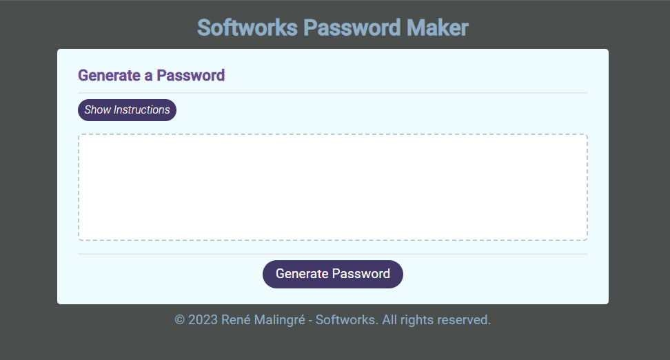
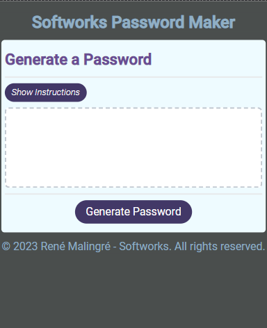
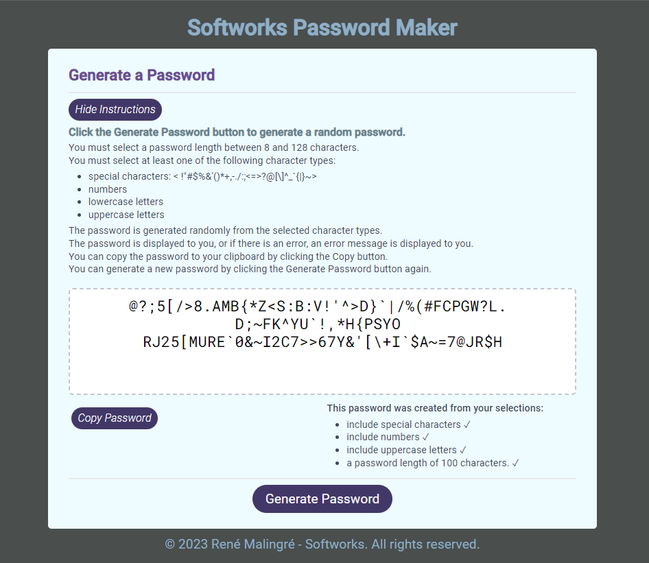
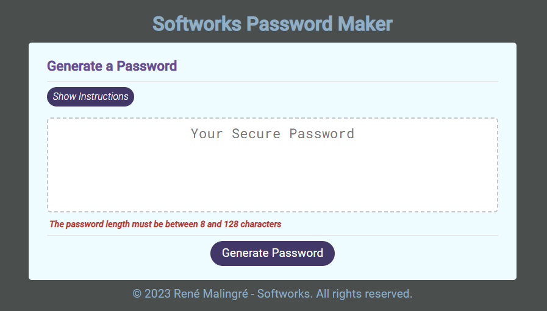

# Softworks Password Maker

This web application allows a user to generate random passwords based on criteria they've selected: specifically the password length and the character types to include.

## Table of Contents

- [Features](#features)
- [Installation and Usage](#installation-and-usage)
- [Technologies Used](#technologies-used)
- [Screenshots](#screenshots)
- [Live URL and Repository](#live-url-and-repository)
- [Credits](#credits)
- [Contributing](#contributing)
- [License](#license)

## Features

 The application runs in a web browser and features dynamically updated HTML and CSS, and is powered by JavaScript. It has a simple, polished and responsive user interface that adapts to multiple screen sizes.

 The user options are as follows:

- Users can select the desired password length:
  - between 8 and 128 characters. This is simple to change in the javascript code.
- Users can choose to include or exclude the following character types:
  - Lowercase letters
  - Uppercase letters
  - Numeric characters
  - Special characters (based on the [OWASP list](https://www.owasp.org/index.php/Password_special_characters))
- User instructions can be shown or hidden by clicking a dedicated button.
- The application validates user input and requires at least one character type to be selected, and it ensures that each selected character type is included at least once.
- Upon completion, the generated password is displayed on the page.
- The user selections are displayed underneath the password to confirm the password criteria. If a user error has been made, an error message is displayed instead.
- The password can be copied to the clipboard by standard keyboard and/or mouse inputs, or by clicking a button dedicated to the purpose.

## Installation and Usage

Clone the repository to your local machine, or go to the [live site](#live-url-and-repository) and open the `index.html` file in your browser to view the portfolio website.

1. Open the application in your web browser.
2. Click the "Show Instructions" button to display the instructions if needed.
3. Click the "Generate Password" button.
4. Follow the prompts to select password criteria, such as length and character types.
5. After answering all prompts, the generated password will be displayed on the page.
6. Click the "Copy Password" button to copy the password to the clipboard, or use mouse or keyboard actions to copy it.
7. Click the "Generate Password" button to generate a new password.

## Technologies Used

- HTML
- CSS
  - Flexbox
  - Media Queries
  - CSS Variables
- JavaScript
  - DOM Manipulation
  - Event Listeners
  - Event Handlers
  - Functions
  - Classes

## Screenshots

### Desktop Browser

### Mobile Browser

### Application Screenshot with instructions and a result

### Application Screenshot with an error message

## Live URL and Repository

The live application can be accessed at the following URL: [Softworks Password Maker](https://renemalingre.github.io/Softworks-Password-Maker/)

The repository can be accessed at the following URL: [Softworks Password Maker Repository](https://github.com/ReneMalingre/Softworks-Password-Maker)

## Credits

- Google Fonts for the typefaces - [Roboto](https://fonts.google.com/specimen/Roboto) and [Roboto Mono](https://fonts.google.com/specimen/Roboto+Mono)

- Special characters list from the [OWASP Foundation](https://www.owasp.org/index.php/Password_special_characters)

- Help from Mozilla [MDN Web Docs](https://developer.mozilla.org/) and OpenAI's [ChatGPT](https://chat.openai.com/chat) for answering my many questions about JavaScript

- Normalize.css v8.0.1 for the CSS reset: [Normalize.css](https://necolas.github.io/normalize.css/)

## Contributing

Contributions to this project will not be accepted, as this project is an assessment piece for a coding course, and it must be the project author's own work. However, feel free to fork the repository and make your own changes.

## License

This project is licensed under the terms of the MIT license.

© 2023 René Malingré
